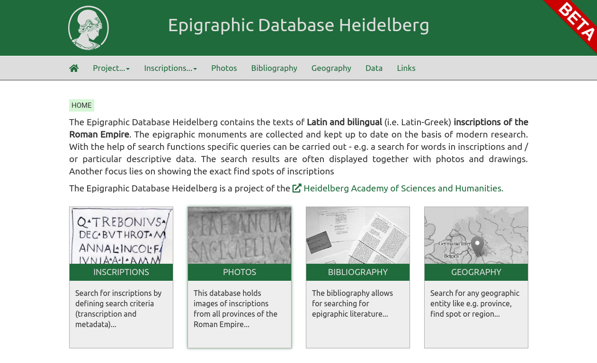

# EDH Website
This is the source code for the next version of the Epigraphic Database Heidelberg website that will replace the current version at https://edh-www.adw.uni-heidelberg.de/home.

The new version is built on the [Python Flask web framework](https://flask.palletsprojects.com), data is hold in an [Apache Solr index](https://lucene.apache.org/solr/).

Code and data can be reused under the [CC BY_SA 4.0 licence](https://creativecommons.org/licenses/by-sa/4.0/).

